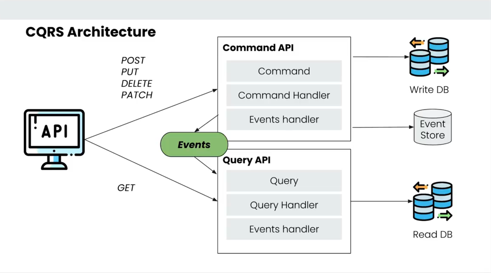
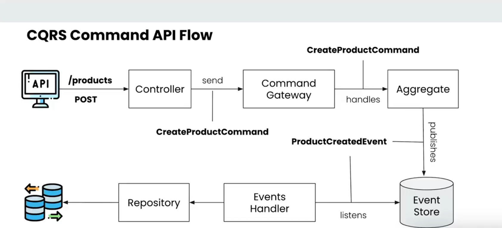

# CQRS using Axon Framework

This repository implements the **Command Query Responsibility Segregation (CQRS)** design pattern using the Axon Framework. The application is focused on a products service, providing a clear example of how to structure Java applications with CQRS and Event Sourcing.

## Table of Contents

- [Overview](#overview)
- [Architecture](#architecture)
- [Features](#features)
- [Tech Stack](#tech-stack)
- [Getting Started](#getting-started)
- [Project Structure](#project-structure)
- [Usage](#usage)
- [Contributing](#contributing)
- [License](#license)

---

## Overview

CQRS is a design pattern that separates the models for reading and writing data, allowing better scalability, maintainability, and clear responsibilities in your codebase. This project demonstrates how to use Axon Framework to implement CQRS and Event Sourcing in a Java application managing product information.

## Architecture

- **Commands**: Write operations (e.g., create, update, delete products)
- **Events**: Represent state changes (e.g., ProductCreatedEvent)
- **Queries**: Read operations (fetch product details, list products)
- **Aggregates**: The domain objects (e.g., ProductAggregate) handling commands and applying events
- **Event Store**: Persist events (using Axon’s event store)
- **Projections**: Build and maintain read models from events



## API Flow



## Features

- Java implementation of CQRS pattern with Axon Framework
- Event Sourcing for immutable history of state changes
- RESTful API for product management
- Simple in-memory or persistent event store (Axon-configurable)
- Example projections for querying products
- Clean separation of command and query models

## Tech Stack

- **Java 17+**
- **Axon Framework**
- **Spring Boot**
- **Maven**
- Optional: **Postgres Database** (for projections/read models), **Axon Server** (for event store)

## Getting Started

### Prerequisites

- JDK 17 or newer
- Maven 3.9+
- Docker

### Running the Application

1. **Clone the repository**
   ```bash
   git clone https://github.com/bruce-mig/axon-cqrs.git
   cd axon-cqrs
   ```
2. **Run docker compose**
    ```bash
   docker compose up -d
   ```

3. **Build the project**
   ```bash
   # Command Service
   cd cmd-service
   mvn clean install
   
   # Query Service
   cd query-service
   mvn clean install
   ```
4. **Run the application**
   ```bash
   # Command Service
   cd cmd-service
   mvn spring-boot:run
   
   # Query Service
   cd query-service
   mvn spring-boot:run
   ```

   The command application will start on `http://localhost:8081`.
   The query application will start on `http://localhost:8085`.

### Configuration

- You can configure Axon event store and projections in `src/main/resources/application.yaml`.
- To use Axon Server, ensure it’s running and set the appropriate properties.

## Project Structure

- **commands/** – Command objects and handlers
- **events/** – Event objects and handlers
- **queries/** – Query objects and handlers
- **aggregates/** – Domain aggregates (e.g., ProductsAggregate)
- **projections/** – Read models and view updaters
- **controllers/** – REST API endpoints

## Usage

### Example Command API Endpoints

- `POST /commands/products` – Create a new product (Command)

- `PATCH /commands/products/{productId}` – Update product details (Command)
- 
- `DELETE /commands/products/{productId}` – Update product details (Command)

### Example Query API Endpoints

- `GET /products/{productId}` – Get product details (Query)
- `GET /products` – List all products (Query)

Use tools like [Postman](https://www.postman.com/) or `curl` to interact with the API.

## Contributing

Contributions are welcome! Feel free to fork the repo and submit a pull request.

1. Fork the repository
2. Create your feature branch (`git checkout -b feature/YourFeature`)
3. Commit your changes (`git commit -am 'Add some feature'`)
4. Push to the branch (`git push origin feature/YourFeature`)
5. Open a pull request

## License

This project is open source under the [MIT License](LICENSE).

---

> **CQRS and Event Sourcing with Axon Framework provide a robust foundation for scalable, maintainable, and evolvable Java applications.**
